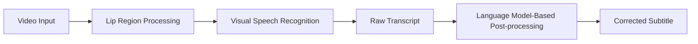

# Lip-Reading-Based Speech Recognition and Text Correction

A visual speech recognition system that generates text from lip movements and improves recognition errors through language-model-based post-processing.

> **Project Archive**
>
> This repository documents a team project developed for the  
> **2025 SOWON HOPE Assistive Technology Design Competition**.
>
> The original implementation was not maintained in a public GitHub repository at the time, and the complete source code is no longer available.
> Therefore, this repository serves as a project archive describing the motivation, system design, my contributions, and results.

---

## Overview

This project aimed to develop an assistive communication system that generates subtitles by recognizing a speaker's lip movements from video.

During development, we found that visual speech recognition models could produce incorrect words when different phonemes had similar lip movements.

Even when the predicted word was visually plausible, it could be inappropriate in the context of the sentence.

To address this issue, we introduced a **language-model-based post-processing module** that corrects contextually inappropriate recognition results.

### Project Information

- **Period:** Jul. 2025 – Sep. 2025
- **Type:** Team Competition Project
- **Domain:** Visual Speech Recognition / NLP / Assistive AI
- **Competition:** 2025 SOWON HOPE Assistive Technology Design Competition
- **Result:** 3rd Prize

---

## Motivation

Lip-reading can provide an alternative communication method when audio information is unavailable or difficult to use.

However, visual speech recognition has an inherent limitation:

> Different phonemes can produce very similar mouth shapes.

As a result, the model may predict a word that looks visually reasonable but does not make sense in the context of the sentence.

For example:

```text
Video Input
    ↓
Lip-Reading Model
    ↓
Raw Recognition Result
    ↓
Language Model-Based Correction
    ↓
Final Subtitle
```

The key idea of this project was to combine:

- **visual information** from lip movements
- **linguistic context** from a language model

to produce more reliable subtitles.

---

## System Architecture



The system consists of two main stages.

### 1. Visual Speech Recognition

The visual speech recognition model analyzes the speaker's lip movements and generates an initial text prediction.

### 2. Contextual Text Correction

The post-processing model analyzes the generated sentence and corrects words that are contextually inappropriate or unnatural.

---

## Key Problem

The main problem we focused on was the mismatch between:

**visual similarity**

and

**linguistic correctness**

A model relying only on lip movements may have difficulty distinguishing visually similar sounds.

```text
Visual Speech Information
          +
   Sentence Context
          ↓
More Reliable Prediction
```

Instead of replacing the original visual speech recognition model, we explored whether a language model could compensate for its weaknesses through contextual post-processing.

---

## My Contributions

My main contributions to the project included:

- Analyzing recognition errors caused by visually similar lip movements
- Identifying cases where the recognition result was visually plausible but contextually inappropriate
- Designing the language-model-based post-processing pipeline
- Developing and evaluating the text correction component
- Integrating the correction module with the visual speech recognition pipeline
- Participating in system development, evaluation, and competition presentation

---

## Text Correction Approach

The post-processing stage was designed to improve the raw transcript generated by the lip-reading model.

The basic process was:

```text
Raw Transcript
      ↓
Context Analysis
      ↓
Error Correction
      ↓
Final Transcript
```

The language model was used to determine whether a predicted word or expression was appropriate within the surrounding sentence context.

The goal was not simply to generate a more fluent sentence, but to reduce recognition errors while preserving the original meaning as much as possible.

---

## Example

### Raw Prediction

```text
[TODO: Add an actual raw prediction from the original project]
```

### After Post-processing

```text
[TODO: Add the corrected sentence]
```

> TODO: Add an actual example from the original project if available.

---

## Results

The proposed system was developed as a working prototype for the competition.

Through the project, we observed that language-model-based post-processing could help correct some recognition errors that were difficult to resolve using visual information alone.

### Competition Result

**3rd Prize**  
2025 SOWON HOPE Assistive Technology Design Competition  
Kwangwoon University

---

## What I Learned

This project was one of my first experiences combining **speech-related AI and natural language processing**.

One of the most important lessons was that improving an AI system does not always require replacing the original model.

Instead, multiple models can complement each other's weaknesses.

In this project:

- the visual model provided information about **what was visually observed**
- the language model provided information about **what was linguistically plausible**

This experience later contributed to my interest in **multimodal AI and language models that combine information from multiple modalities**.

---

## Limitations

### Visual Ambiguity

Some phonemes are inherently difficult to distinguish using only lip movements.

### Over-Correction

A language model may produce a sentence that is grammatically natural but differs from what the speaker actually intended.

Therefore, contextual correction should be applied carefully.

### Limited Evaluation

The project was developed primarily as a competition prototype.

A more rigorous evaluation would require metrics such as:

- Word Error Rate (WER)
- Sentence Error Rate
- Correction Accuracy
- Performance before and after post-processing
- Error analysis by phoneme or word type

---

## Future Work

Possible future directions include:

- Confidence-aware text correction
- Joint visual-language modeling
- Audio-visual speech recognition
- Multimodal foundation models for visual speech understanding
- Context-aware correction using modern LLMs
- Domain-adaptive post-processing
- Evaluation on public visual speech recognition benchmarks

A particularly interesting extension would be to replace the separated pipeline with a model that jointly learns **visual speech information and linguistic context**.

---

## Tech Stack

> Add only technologies that were actually used in the original project.

- Python
- PyTorch
- [TODO: Visual Speech Recognition Model]
- [TODO: Text Correction Model]
- [TODO: Other libraries / frameworks]

---

## Repository Structure

This repository currently serves as a documentation archive.

```text
lip-reading-text-correction/
├── README.md
└── assets/
    ├── architecture.png
    ├── demo.png
    └── presentation.png
```

---

## Code Availability

The original implementation was developed as part of a team competition project in 2025.

At the time, the project was not maintained in a public GitHub repository, and the complete source code is no longer available for release.

This repository therefore focuses on documenting:

- the problem
- the system architecture
- my contribution
- the project outcome
- lessons learned

No source code is claimed to be reproduced here.

---

## References

### Visual Speech Recognition

- [TODO: Add the paper / repository for the lip-reading model used in the project]

### Text Correction / Language Model

- [TODO: Add the paper / model used for text correction]

### Competition

- 2025 SOWON HOPE Assistive Technology Design Competition
- Kwangwoon University, Republic of Korea

---

## Author

**Suchan Yang**

B.S. Candidate in Language & AI  
Hankuk University of Foreign Studies

- GitHub: https://github.com/EricYang544
- Email: yangsuchan@naver.com
